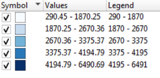

# 🚗 FlowCast : Bangalore Travel Time & Fare Predictor  

**FlowCast** predicts average **inter-ward travel time and fare** in Bangalore using Uber Movement data and GeoJSON ward boundaries.  
It combines **spatial (distance)** and **temporal (hour of day)** features with machine learning to analyze and forecast urban mobility patterns.

---

## 📊 Project Overview  
- **Goal:** Estimate average travel duration and fare between Bangalore wards.  
- **Data Sources:**  
  - Uber Movement Bangalore dataset (aggregated hourly mean travel times).  
  - Bangalore ward GeoJSON for spatial geometry.  
- **Tech Stack:**  
  `Python` · `Pandas` · `GeoPandas` · `scikit-learn` · `Plotly` · `Streamlit` · `Joblib`

---

## 🧠 Approach  

1. **Data Preparation**
   - Merged Uber CSV with ward GeoJSON using `WARD_NO` → `sourceid` / `dstid`.
   - Computed centroids and Haversine distance (km).
   - Engineered features: `distance_km`, `hod`, `rush_hour`.

2. **Exploratory Analysis**
   - Hourly trends of travel time.  
   - Correlations between distance, time, and congestion.  
   - Geo-visualization using Plotly choropleths.

3. **Modeling**
   | Model | MAE (sec) | R² |
   |:------|-----------:|---:|
   | Linear Regression | 881.68 | 0.18 |
   | **Random Forest** | **484.78** | **0.67** |

   - Random Forest captures non-linear structure between distance and time.  
   - Distance dominates feature importance (0.76), followed by hour of day (0.23).  
   - Residuals show low bias and good generalization.

4. **Deployment**
   - Lightweight Random Forest models (compressed) served via **Streamlit Cloud**.  
   - Users can input distance and hour to predict travel time and fare instantly.

---

## 💡 Key Insights  

- Travel duration increases sharply during **8–10 AM** and **5–8 PM** (rush hours).  
- **Distance** explains ~76 % of the variance in travel time.  
- Central and IT-corridor wards show the highest congestion.  
- Random Forest achieved strong accuracy (R² ≈ 0.67) with minimal preprocessing.  

---

## 🌐 Live Demo  
👉 [**FlowCast : Bangalore Travel Time & Fare Predictor**](https://<your-username>-bangalore-traffic-ml.streamlit.app)

---

## 🗺️ Example Visualizations  

| Ward-wise Avg Travel Time | Hourly Variation |
|:--------------------------:|:----------------:|
|  |  |

*(optional – add screenshots from your notebook or app)*

---

## 🔧 How to Run Locally  

```bash
# Clone repo
git clone https://github.com/<your-username>/bangalore-traffic-ml.git
cd bangalore-traffic-ml/app

# Install dependencies
pip install -r ../requirements.txt

# Run Streamlit app
streamlit run streamlit_app.py
